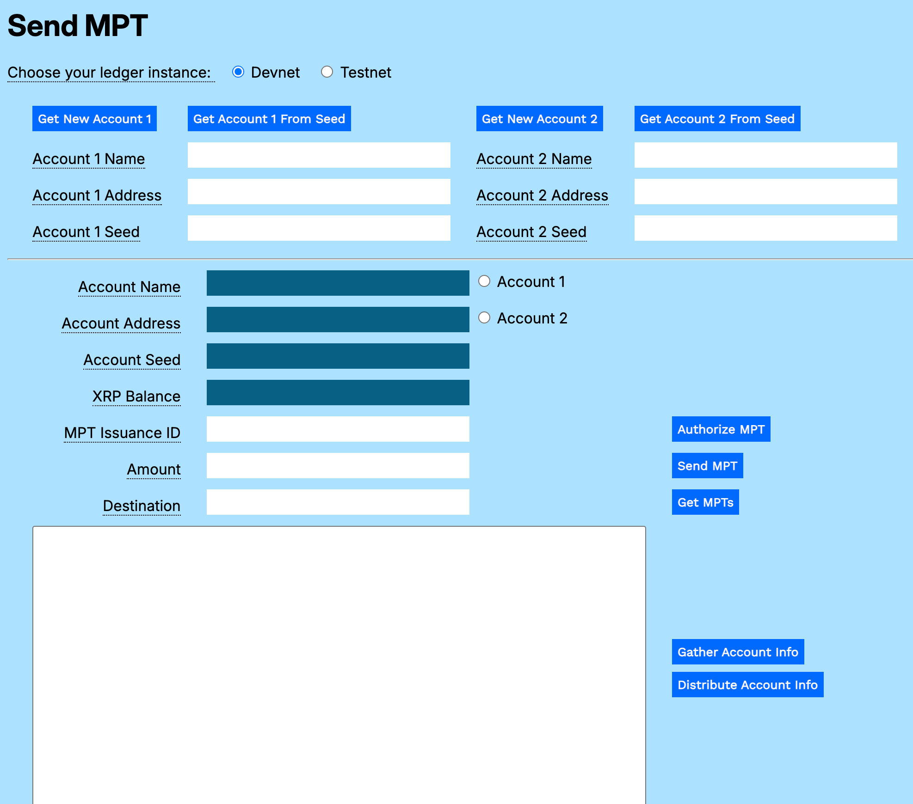
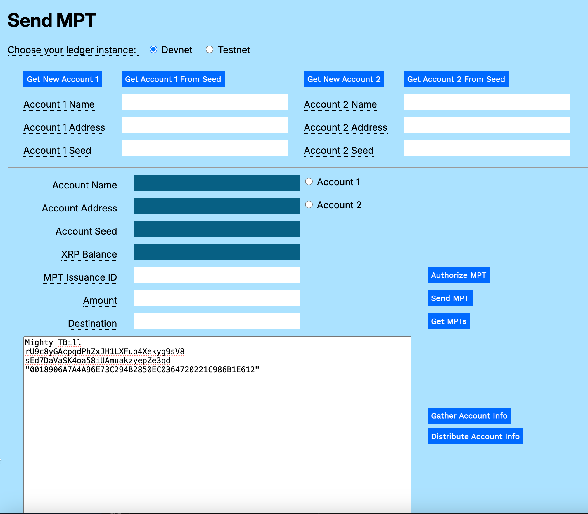
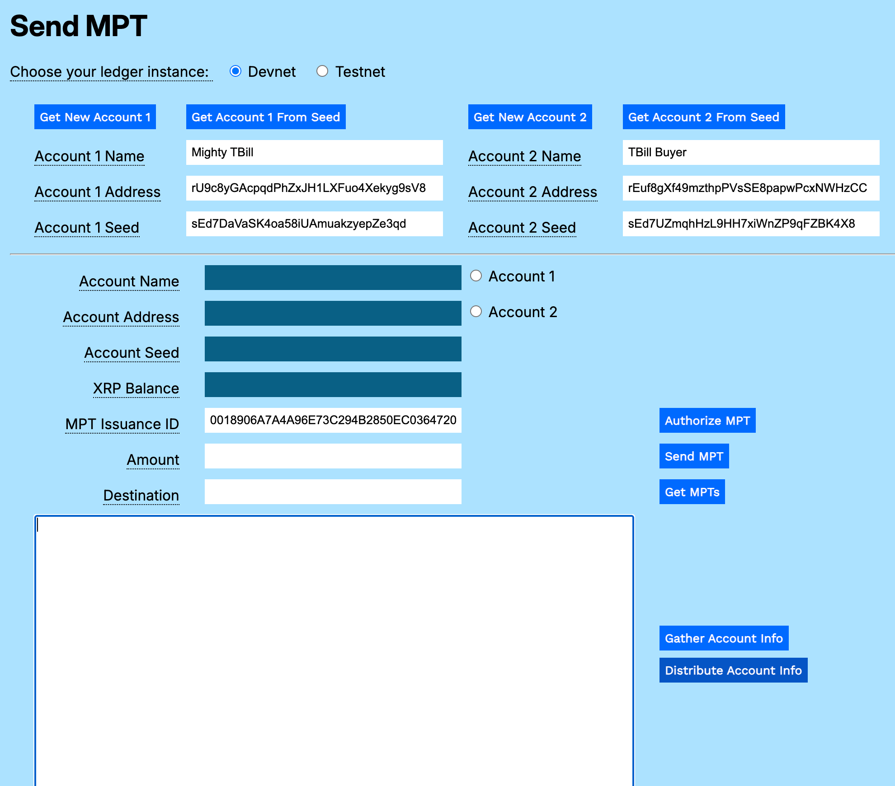
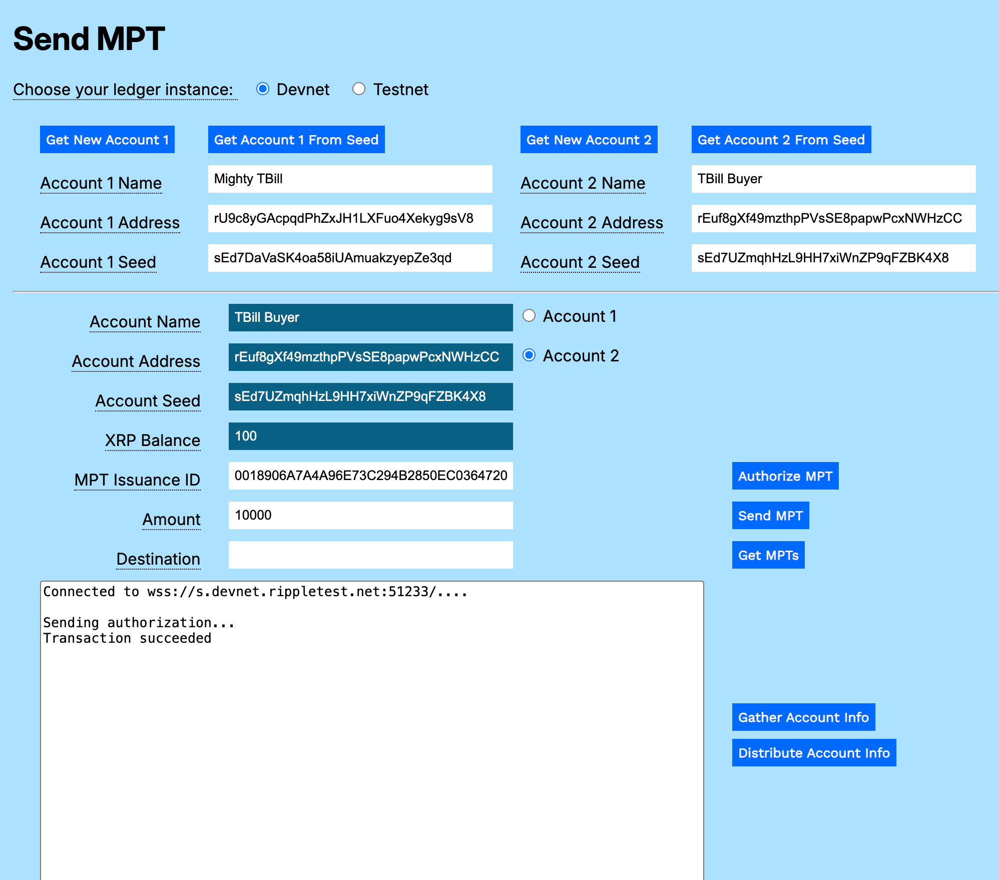
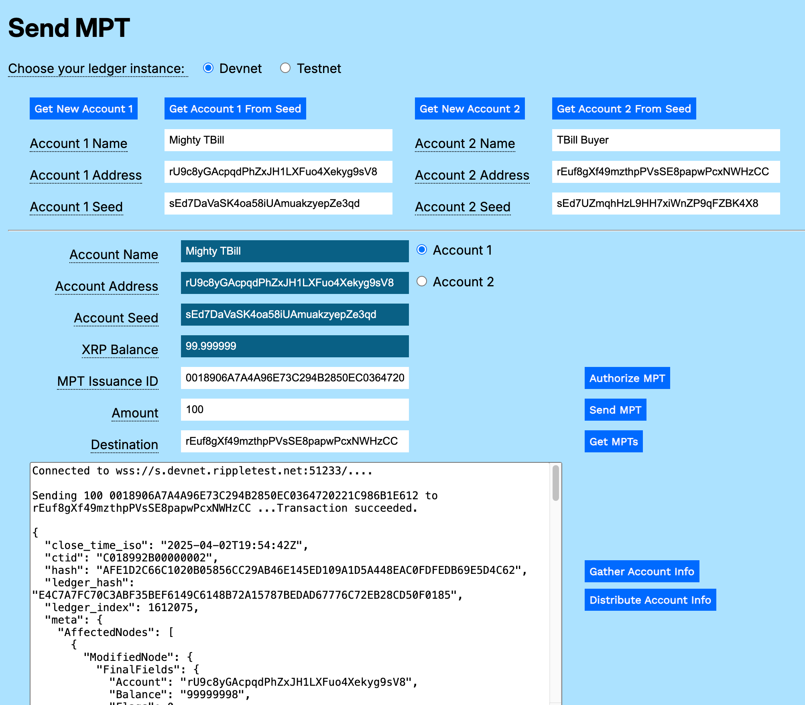
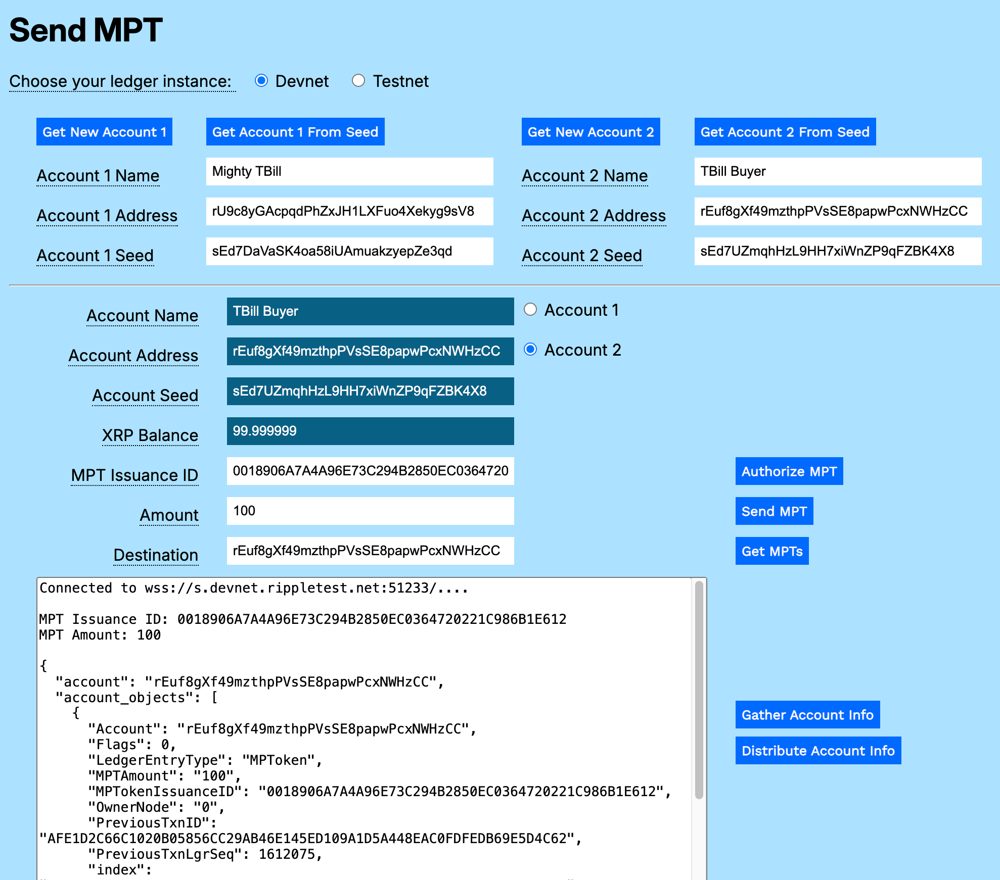

---
seo:
    description: Issue an asset-backed token such as a US Treasury bill using multi-purpose tokens.
labels:
  - Tokens
  - MPT
---
# Sending MPTs

_(Requires the [MPToken amendment][] )_

To send an MPT to another account, the receiving account must first authorize the receipt of the MPT, based on its MPToken Issuance ID. This is to prevent malicious users from spamming accounts with unwanted tokens that could negatively impact storage and XRP reserves.

Once an account receives an MPT, it can send the MPT to another account, provided the MPT was created with the _Can Transfer_ flag set, and the receiving account authorizes the MPT.

## Send MPT Utility

The Send MPT utility <!-- embedded below -->lets you create an account, authorize it to receive a specific MPT issuance, then send it the authorized MPT from an issuer or holder account. (You can issue an MPT using the [MPT Generator](../../../use-cases/tokenization/creating-an-asset-backed-multi-purpose-token.md) utility.)

[](../../../img/mt-send-mpt-0-empty-form.png)

You can download a [standalone version of the MPT Sender](../../../../_code-samples/mpt-sender/send-mpt.zip) as sample code<!--, or use the embedded form that follows-->.

## Get Accounts

To send an MPT, you need the **Seed** value for the MPT issuer to retrieve its account, then you need either a new account or an account seed for the target account. You can use the [MPT Generator](../../../use-cases/tokenization/creating-an-asset-backed-multi-purpose-token.md) to create a new MPT for transfer.

To get the accounts:

1. Open <tt>send-mpt.html</tt> in a browser.
2. Choose your ledger instance (**Devnet** or **Testnet**).
3. If you used the MPT Generator:
   1. Paste the gathered info in the **Result** field.
   [](../../../img/mt-send-mpt-1-gathered-info.png)
   2. Cut and paste the MPT Issuance ID to the **MPT Issuance ID** field.
   3. Click **Distribute Account Info** to populate the **Account 1** fields.<br/><br/>
   If you did not use the MPT Generator, enter the **Account 1 Name**, **Account 1 Address**, **Account 1 Seed**, and **MPT Issuance ID** in the corresponding fields.)
4. Click **Get New Account 2**, or use a seed to **Get Account 2 from Seed**.
5. Optionally, add the **Account 2 Name**, an arbitrary human-readable name that helps to differentiate the accounts.
[](../../../img/mt-send-mpt-2-account-2.png)

## Authorize MPT

To receive MPTs, an account needs to authorize the MPT.

To authorize Account 2 to accept MPTs:

1. Click the **Account 2** radio button.
2. Enter an **Amount**, the maximum number of MPTs the account will accept.
2. Click **Authorize MPTs**.
[](../../../img/mt-send-mpt-2-authorize-mpt.png)

## Send MPT

To send an MPT:

1. Click the **Account 1** radio button.
3. Enter the **MPT Issuance ID**.
2. Enter an **Amount** of MPTs to send.
3. Enter the **Destination** (likely the value in the **Account 2 Address** field, but it can be any account on the same ledger instance).
4. Click **Send MPT**.
[](../../../img/mt-send-mpt-3-send-mpt.png)

## Get MPTs

To verify receipt of the MPTs:

1. Click the **Account 2** radio button.
2. Click **Get MPTs**.
[](../../../img/mt-send-mpt-4-get-mpts.png)

# Code Walkthrough

You can download a [standalone version of the MPT Sender](../../../../_code-samples/mpt-sender/send-mpt.zip) as sample code.

## send-mpt.js

The code that supports the MPT features is in the `send-mpt.js` file. Standard support for connecting to the XRP Ledger is included in the `account-support.js` file.

### sendMPT()

Connect to the XRP Ledger.

```javascript    
async function sendMPT() {
  let net = getNet()
  const client = new xrpl.Client(net)
  await client.connect()
  let results = `===Connected to ${net}.===\n===Sending MPT.===\n`
  resultField.value = results
```

Instantiate the parameter variables.

```javascript
  try {
    const wallet = xrpl.Wallet.fromSeed(accountSeedField.value)
    const mpt_issuance_id = mptIdField.value
    const mpt_quantity = amountField.value
```

Create a Payment transaction using the MPT for the Amount.

```javascript
    const send_mpt_tx = {
      "TransactionType": "Payment",
      "Account": wallet.address,
      "Amount": {
        "mpt_issuance_id": mpt_issuance_id,
        "value": mpt_quantity,
      },
      "Destination": destinationField.value,
    }
```

Prepare and sign the transaction.

```javascript
    const pay_prepared = await client.autofill(send_mpt_tx)
    const pay_signed = wallet.sign(pay_prepared)
```

Send the prepared transaction and report the results.

```javascript
    results += `\n===Sending ${mpt_quantity} ${mpt_issuance_id} to ${destinationField.value} ...`
    resultField.value = results
    const pay_result = await client.submitAndWait(pay_signed.tx_blob)
    results += '\n\n===Transaction succeeded.\n'
    results += JSON.stringify(pay_result.result, null, 2)
    resultField.value += results
  }
```

Catch and report any errors, then disconnect from the XRP Ledger.

```javascript
  catch (error) {
    results = `Error sending MPT: ${error}`
    resultField.value += results
  }
  finally {
    client.disconnect()
  }
} // end of sendMPT()
```

## getMPTs

Get all of the MPTs for the selected account by filtering for MPT objects and looping through the array to display them one at a time.

Connect to the XRPL ledger.

```javascript
async function getMPTs() {
  let net = getNet()
  const client = new xrpl.Client(net)
  await client.connect()
  const wallet = xrpl.Wallet.fromSeed(accountSeedField.value)
  let results = ''
  resultField.value = `===Connected to ${net}. Getting MPTs.===`
```

Send an `account_objects` request, specifying the type _mptoken_. Wait for the results.

```javascript
  try {
    const wallet = xrpl.Wallet.fromSeed(accountSeedField.value)
    const mpts = await client.request({
        command: "account_objects",
        account: wallet.address,
        ledger_index: "validated",
        type: "mptoken"
      })
```

Stringify and parse the JSON result string.

```javascript
    let JSONString = JSON.stringify(mpts.result, null, 2)
    let JSONParse = JSON.parse(JSONString)
    let numberOfMPTs = JSONParse.account_objects.length
```

Loop through the filtered array of account_objects to list all of the MPTs held by the account.

```javascript
    let x = 0
    while (x < numberOfMPTs){
      results += "\n\n===MPT Issuance ID: " + JSONParse.account_objects[x].MPTokenIssuanceID
              + "\n===MPT Amount: " + JSONParse.account_objects[x].MPTAmount
      x++
    }
```

Return the parsed results, followed by the raw results.

```javascript
    results += "\n\n" + JSONString
    resultField.value += results
```

Catch and report any errors, then disconnect from the XRP Ledger.

```javascript
  } catch (error) {
    results = `===Error getting MPTs: ${error}`
    resultField.value += results
  }
  finally {
    client.disconnect()
  }
} // End of getMPTs()
```

## authorizeMPT

Before you can send an MPT to another account, the target account must authorize the MPT.

Connect to the XRPL and instantiate the account wallet.

```javascript
async function authorizeMPT() {
  let net = getNet()
  const client = new xrpl.Client(net)
  await client.connect()
  let results = `Connected to ${net}....`
  resultField.value = results
  const wallet = xrpl.Wallet.fromSeed(accountSeedField.value)
```

Capture the MPT issuance ID in a variable.

```javascript
  const mpt_issuance_id = mptIdField.value
```

Create the MPTokenAuthorize transaction, passing the target account's address and the MPT Issuance ID.

```javascript
  const auth_mpt_tx = {
    "TransactionType": "MPTokenAuthorize",
    "Account": wallet.address,
    "MPTokenIssuanceID": mpt_issuance_id,
  }
```

Prepare, sign, and send the transaction.

```javascript
  const auth_prepared = await client.autofill(auth_mpt_tx)
  const auth_signed = wallet.sign(auth_prepared)
  results += `\n\nSending authorization...`
  resultField.value = results
  const auth_result = await client.submitAndWait(auth_signed.tx_blob)
```

Report the results.

```javascript
  if (auth_result.result.meta.TransactionResult == "tesSUCCESS") {
    results += `\nTransaction succeeded`
    resultField.value = results
  } else {
    results += `\nTransaction failed: ${auth_result.result.meta.TransactionResult}`
    resultField.value = results
  }
  client.disconnect()
} // end of MPTAuthorize()

```

## send-mpt.html

```html
<html>
<head>
    <title>Send MPT</title>
    <link href='https://fonts.googleapis.com/css?family=Work Sans' rel='stylesheet'>
    <link href="modular-tutorials.css" rel="stylesheet">
    <script src='https://unpkg.com/xrpl@4.1.0/build/xrpl-latest.js'></script>
    <script src="account-support.js"></script>
    <script src='send-mpt.js'></script>
    <script>
        if (typeof module !== "undefined") {
            const xrpl = require('xrpl')
        }
    </script>
</head>

<!-- ************************************************************** -->
<!-- ********************** The Form ****************************** -->
<!-- ************************************************************** -->

<body>
    <h1>Send MPT</h1>
    <form id="theForm">
        <span class="tooltip" tooltip-data="Choose the XRPL host server for your account.">
            Choose your ledger instance:
        </span>
        &nbsp;&nbsp;
        <input type="radio" id="dn" name="server" value="wss://s.devnet.rippletest.net:51233" checked>
        <label for="dn">Devnet</label>
        &nbsp;&nbsp;
        <input type="radio" id="tn" name="server" value="wss://s.altnet.rippletest.net:51233">
        <label for="tn">Testnet</label>
        <br /><br />
        <table>
            <tr>
                <td>
                    <button type="button" onClick="getNewAccount1()">Get New Account 1</button>
                </td>
                <td>
                    <button type="button" onClick="getAccountFromSeed1()">Get Account 1 From Seed</button>
                </td>
                <td>
                    <button type="button" onClick="getNewAccount2()">Get New Account 2</button>
                </td>
                <td>
                    <button type="button" onClick="getAccountFromSeed2()">Get Account 2 From Seed</button>
                </td>
            </tr>
            <tr>
                <td>
                        <span class="tooltip" tooltip-data="Arbitrary human-readable name for the account."><label for="account1name">Account 1 Name</label>
                        </span>
                </td>
                <td>
                    <input type="text" id="account1name" size="40"></input>
                </td>
                <td>
                    <span class="tooltip" tooltip-data="Arbitrary human-readable name for the account.">
                        <label for="account2name">Account 2 Name</label>
                    </span>
                </td>
                <td>
                    <input type="text" id="account2name" size="40"></input>
                </td>
            </tr>
            <tr>
                <td>
                    <span class="tooltip" tooltip-data="Identifying address for the account.">
                        <label for="account1address">Account 1 Address</label>
                    </span>
                </td>
                <td> 
                    <input type="text" id="account1address" size="40"></input>
                </td>
                <td>
                    <span class="tooltip" tooltip-data="Identifying address for the account.">
                        <label for="account2address">Account 2 Address</label>
                    </span>
                </td>
                <td>
                    <input type="text" id="account2address" size="40"></input>
                </td>
            </tr>
            <tr>
                <td>
                    <span class="tooltip" tooltip-data="Seed for deriving public and private keys for the account.">
                        <label for="account1seed">Account 1 Seed</label>
                    </span>
                </td>
                <td>
                    <input type="text" id="account1seed" size="40"></input>
                </td>
                <td>
                    <span class="tooltip" tooltip-data="Seed for deriving public and private keys for the account.">
                        <label for="account2seed">Account 2 Seed</label>
                    </span>
                </td>
                <td>
                    <input type="text" id="account2seed" size="40"></input>
                </td>
            </tr>
            </table>
            <hr />
            <table>
            <tr valign="top">
                <td align="right">
                    <span class="tooltip" tooltip-data="Name of the currently selected account.">
                        <label for="accountNameField">Account Name</label>
                    </span>
                </td>
                <td>
                    <input type="text" id="accountNameField" size="40" readonly></input>
                    <input type="radio" id="account1" name="accounts" value="account1">
                    <label for="account1">Account 1</label>
                </td>
            </tr>
            <tr valign="top">
                <td align="right">
                    <span class="tooltip" tooltip-data="Address of the currently selected account.">
                        <label for="accountAddressField">Account Address</label>
                    </span>
                </td>
                <td>
                    <input type="text" id="accountAddressField" size="40" readonly></input>
                    <input type="radio" id="account2" name="accounts" value="account2">
                    <label for="account2">Account 2</label>
                </td>
            </tr>
            <tr valign="top">
                <td align="right">
                    <span class="tooltip" tooltip-data="Seed of the currently selected account.">
                        <label for="accountSeedField">Account Seed</label>
                    </span>
                </td>
                <td>
                    <input type="text" id="accountSeedField" size="40" readonly></input>
                    <br>
                </td>
            </tr>
            <tr>
                <td align="right">
                    <span class="tooltip" tooltip-data="XRP balance for the currently selected account.">
                        <label for="xrpBalanceField">XRP Balance</label>
                    </span>
                </td>
                <td>
                    <input type="text" id="xrpBalanceField" size="40" readonly></input>
                </td>
            </tr>
            <tr>
                <td align="right">
                    <span class="tooltip" tooltip-data="Issuance ID of the MPT you want to trade.">
                    <lable for="mptIdField">MPT Issuance ID</lable>
                    </span>
                </td>
                <td>
                    <input type="text" id="mptIdField" size="40"></input>
                    <br>
                </td> 
                <td>
                    <button type="button" onClick="authorizeMPT()">Authorize MPT</button>
                </td>               
            </tr>
            <tr>
                <td align="right">
                    <span class="tooltip" tooltip-data="Number of MPTs to send.">
                        <label for="amountField">Amount</label>
                    </span>
                </td>
                <td>
                    <input type="text" id="amountField" size="40"></input>
                    <br>
                </td>
                <td>
                    <button type="button" onClick="sendMPT()">Send MPT</button>
                </td>  

            </tr>
            <tr>
                <td align="right">
                    <span class="tooltip" tooltip-data="Destination account address for MPT transfer.">
                    <lable for="destinationField">Destination</lable>
                    </span>
                </td>
                <td>
                    <input type="text" id="destinationField" size="40"></input>
                    <br>
                </td>
                <td align="left" valign="top">
                    <button type="button" onClick="getMPTs()">Get MPTs</button>
                </td>
            </tr>
            <tr>
                <td colspan="2">
                    <p align="right">
                        <textarea id="resultField" cols="80" rows="20"></textarea>
                    </p>
                </td>
                <td align="left" valign="top">
                    <button type="button" onClick="gatherAccountInfo()">Gather Account Info</button><br/>
                    <button type="button" onClick="distributeAccountInfo()">Distribute Account Info</button>
                </td>
            </tr>
        </table>
    </form>
</body>
<script>
    let radioButtons = document.querySelectorAll('input[type="radio"]');
    radioButtons.forEach(radio => {
        radio.addEventListener('change', function() {
            if (this.value === 'account1') {
                populate1()
            } else if (this.value === 'account2') {
                populate2()
            }
        });
    });
</script>
</html>
```
<!--
<div>
    <link href='https://fonts.googleapis.com/css?family=Work Sans' rel='stylesheet'>
    <script src='https://unpkg.com/xrpl@4.1.0/build/xrpl-latest.js'></script> 
<script>
    if (typeof module !== "undefined") {
    const xrpl = require("xrpl")
}
    document.addEventListener("DOMContentLoaded", function() {
        getHolderAccountFromSeedButton.addEventListener("click", getHolderFromSeed)
        getReceiverAccountButton.addEventListener("click", getAccount)
        getReceiverFromSeedButton.addEventListener("click", getReceiverFromSeed)
        authorizeMPTButton.addEventListener("click", authorizeMPT)
        sendMPTButton.addEventListener("click", sendMPT)
        getMPTsButton.addEventListener("click", getMPTs)
 })
function getNet() {
    let net
    if (document.getElementById("tn").checked) net = "wss://s.altnet.rippletest.net:51233"
    if (document.getElementById("dn").checked) net = "wss://s.devnet.rippletest.net:51233"
    return net
  } // End of getNet()           
  // *******************************************************
  // ************* Get Account *****************************
  // *******************************************************
  async function getAccount() {
    let net = getNet()
    const client = new xrpl.Client(net)
    receiverAccountField.value = "Getting a new account..."
    results = 'Connecting to ' + net + '....'
  //-------------------------------This uses the default faucet for Testnet/Devnet.
    let faucetHost = null
    await client.connect()
    results += '\nConnected, funding wallet.'
  // ----------------------------------------Create and fund a test account wallet.
    const my_wallet = (await client.fundWallet(null, { faucetHost })).wallet
    results += '\nGot a wallet.'
  // ------------------------------------------------------Get the current balance.
    receiverAccountField.value = my_wallet.address
    receiverSeedField.value = my_wallet.seed
    results += '\nAccount created.'
    console.log(results)
    client.disconnect()
  } // End of getAccount()
// **********************************************************
// *********** Get Holder from Seed *************************
// **********************************************************
  async function getHolderFromSeed() {
    let net = getNet()
    const client = new xrpl.Client(net)
    holderAccountField.value = "Getting holder account from seed..."
    results = 'Connecting to ' + getNet() + '....'
    await client.connect()
    results += '\nConnected, finding wallets.\n'
    console.log(results)
  // --------------------------------------------------Find the test account wallet.    
    const my_wallet = xrpl.Wallet.fromSeed(holderSeedField.value)    
  // -------------------------------------------------------Get the current balance.
    holderAccountField.value = my_wallet.address
    holderSeedField.value = my_wallet.seed      
    client.disconnect()
  } // End of getHolderFromSeed()
// **********************************************************
// *********** Get Receiver from Seed *************************
// **********************************************************
  async function getReceiverFromSeed() {
    let net = getNet()
    const client = new xrpl.Client(net)
    receiverAccountField.value = "Getting receiver account from seed..."
    results = 'Connecting to ' + getNet() + '....'
    await client.connect()
    results += '\nConnected, finding wallets.\n'
    resultsArea.value = results
  // --------------------------------------------------Find the test account wallet.    
    const my_wallet = xrpl.Wallet.fromSeed(receiverSeedField.value)    
  // -------------------------------------------------------Get the current balance.
    receiverAccountField.value = my_wallet.address
    receiverSeedField.value = my_wallet.seed 
    resultsArea.value = results     
    client.disconnect()
  } // End of getReceiverFromSeed()
  // *******************************************************
  // *************** Send MPT **********************
  // *******************************************************
async function sendMPT() {
  let net = getNet()
  const client = new xrpl.Client(net)
  results = 'Connecting to ' + getNet() + '....'
  resultsArea.value = results
  await client.connect()
  results += '\nConnected.'
  resultsArea.value = results  
  const holder_wallet = xrpl.Wallet.fromSeed(holderSeedField.value)
  const mpt_issuance_id = mptIssuanceIDField.value
  const mpt_quantity = quantityField.value
  const send_mpt_tx = {
    "TransactionType": "Payment",
    "Account": holder_wallet.address,
    "Amount": {
      "mpt_issuance_id": mpt_issuance_id,
      "value": mpt_quantity,
    },
    "Destination": receiverAccountField.value,
  }
  const pay_prepared = await client.autofill(send_mpt_tx)
  const pay_signed = holder_wallet.sign(pay_prepared)
  results += `\n\nSending ${mpt_quantity} ${mpt_issuance_id} to ${receiverAccountField.value} ...`
  resultsArea.value = results
  const pay_result = await client.submitAndWait(pay_signed.tx_blob)
  if (pay_result.result.meta.TransactionResult == "tesSUCCESS") {
        results += 'Transaction succeeded.\n\n'
        results += JSON.stringify(pay_result.result, null, 2)
    resultsArea.value = results
  } else {
    results += 'Transaction failed: See JavaScript console for details.'
    results += JSON.stringify(pay_result.result, null, 2)
    resultsArea.value = results
  }
  client.disconnect()
} // end of sendMPT()
// *******************************************************
// ******************** Get MPTs *************************
// *******************************************************
async function getMPTs() {
  let net = getNet()
  const client = new xrpl.Client(net)
  results = 'Connecting to ' + getNet() + '....'
  resultsArea.value = results
  await client.connect()
  const receiver_wallet = xrpl.Wallet.fromSeed(receiverSeedField.value)
  results += '\nConnected.'
  resultsArea.value = results
  const mpts = await client.request({
      command: "account_objects",
      account: receiver_wallet.address,
      ledger_index: "validated",
      type: "mptoken"
    })
  let JSONString = JSON.stringify(mpts.result, null, 2)
  let JSONParse = JSON.parse(JSONString)
  let numberOfMPTs = JSONParse.account_objects.length
  let x = 0
  while (x < numberOfMPTs){
  results += "\n\nMPT Issuance ID: " + JSONParse.account_objects[x].MPTokenIssuanceID
             + "\nMPT Amount: " + JSONParse.account_objects[x].MPTAmount
    x++
  }
  results += "\n\n" + JSONString
  resultsArea.value = results
  client.disconnect()
} // End of getMPTs()
// **********************************************************************
// ****** MPTAuthorize Transaction ***************************************
// **********************************************************************
async function authorizeMPT() {
  let net = getNet()
  const client = new xrpl.Client(net)
  results = 'Connecting to ' + getNet() + '....'
  resultsArea.value = results
  await client.connect()
  const receiver_wallet = xrpl.Wallet.fromSeed(receiverSeedField.value)
  const mpt_issuance_id = mptIssuanceIDField.value
  const auth_mpt_tx = {
    "TransactionType": "MPTokenAuthorize",
    "Account": receiver_wallet.address,
    "MPTokenIssuanceID": mpt_issuance_id,
  }
  const auth_prepared = await client.autofill(auth_mpt_tx)
  const auth_signed = receiver_wallet.sign(auth_prepared)
  results += `\n\nSending authorization...`
  resultsArea.value = results
  const auth_result = await client.submitAndWait(auth_signed.tx_blob)
  console.log(JSON.stringify(auth_result.result, null, 2))
  if (auth_result.result.meta.TransactionResult == "tesSUCCESS") {
    results += `Transaction succeeded`
    resultsArea.value = results
  } else {
    results += 'Transaction failed: See JavaScript console for details.'
    resultsArea.value = results
  }
  client.disconnect()
} // end of MPTAuthorize()
</script>
<div>
<form>
    <link href='https://fonts.googleapis.com/css?family=Work Sans' rel='stylesheet'>
    <script src='https://unpkg.com/xrpl@4.1.0/build/xrpl-latest.js'></script> 
<!-- Required meta tags - - >
    <meta charset="utf-8">
    <meta name="viewport" content="width=device-width, initial-scale=1, shrink-to-fit=no">
    <div class="container">
      <div class="row">
        <div class="col align-self-start">
        <h4>MPT Sender</h4>
        </div>
      </div>
        <div class="row">
            <div class="col align-self-start">
              <b>1. Choose your preferred network.</b>
            </div>
            <div class="col align-self-center">
              <input type="radio" id="tn" name="server"
                  value="wss://s.altnet.rippletest.net:51233">
              <label for="tn">Testnet</label>
              <br/>
              <input type="radio" id="dn" name="server"
                  value="wss://s.devnet.rippletest.net:51233" checked>
              <label for="dn">Devnet</label>
            </div>
        </div>
        <div class="row">
            <div class="col align-self-start">
              <b>2. Get the holder (or issuer) account from its seed.<br/>
            </div>
          </div>
          <div class="row">
            <div class="col align-self-start">
              <label for="holderSeedField">Holder Seed</label>
            </div>
          </div>
          <div class="row">
            <div class="col align-self-start">
              <input type="text" id="holderSeedField" size="40"></input>
              <br/><br/>
            </div>
          </div>
          <div class="row">
            <div class="col align-self-start">
              <label for="holderAccountField">Holder Account</label>
            </div>
          </div>
          <div class="row">
            <div class="col align-self-start">
              <input type="text" id="holderAccountField" size="40"></input>
            </div>
          </div>
          <br/>
          </div>
          <div class="row">
            <div class="col align-self-start">
              <button type="button" id="getHolderAccountFromSeedButton" class="btn btn-primary">Get Holder Account From Seed</button>
              <br/><br/>
            </div>
          </div>
          <div class="row">
            <div class="col align-self-start">
              <b>3. Get a new receiver account or retrieve one from its seed.</b>
                  <div class="row">
            <div class="col align-self-start">
              <label for="receiverSeedField">Receiver Seed</label>
            </div>
          </div>
          <div class="row">
            <div class="col align-self-start">
              <input type="text" id="receiverSeedField" size="40"></input>
              <br/><br/>
            </div>
          </div>
          <div class="row">
            <div class="col align-self-start">
              <label for="receiverAccountField">Receiver Account</label>
            </div>
          </div>
          <div class="row">
            <div class="col align-self-start">
              <input type="text" id="receiverAccountField" size="40"></input>
            </div>
          </div>
          <div class="row">
            <div class="col align-self-start">
              <button type="button" id="getReceiverAccountButton" class="btn btn-primary">Get New Receiver Account</button>
              </div>
              <div class="col align-self-start">
              <button type="button" id="getReceiverFromSeedButton" class="btn btn-primary">Get Receiver Account From Seed</button>
              <br/><br/>
              </div>
            </div>
          </div>
        </div>
        <div class="row">
          <div class="col align-self-start">
            <b>4. Enter the <i>MPT Issuance ID</i>.</b>
          </div>
        </div>
        <div class="row">
            <div class="col align-self-start">
                <label for="mptIssuanceIDField">MPT Issuance ID</label>
            </div>
        </div>
        <div class="row">
            <div class="col align-self-start">
              <input type="text" id="mptIssuanceIDField" size="40"></input>
              <br/><br/>
            </div>
        </div>
        <div class="row">
          <div class="col align-self-start">
            <b>5. Click <i>Authorize MPT</i> to authorize the MPT for the receiver.</b>
          </div>
        </div>
        <div class="row">
            <button type="button" id="authorizeMPTButton" class="btn btn-primary">Authorize MPT</button>
        </div>
        <br/>
        </div>
        <div class="row">
          <div class="col align-self-start">
            <b>5. Enter the <i>Quantity</i> of MPTs to send.</b>
          </div>
        </div>
        <div class="row">
            <div class="col align-self-start">
                <label for="quantity">Quantity</label>
            </div>
        </div>
        <div class="row">
            <div class="col align-self-start">
                <input type="text" id="quantityField" size="40"></input>
            </div>
        </div>
    <div class="row">
        <div class="col-align-items-left">
        <br/>
          <p><b>6. Click Send MPTs</b><br/>
             <button type="button" id="sendMPTButton" class="btn btn-primary">Send MPTs</button>
          </p>
          </div>
    </div>
    <div class="row">
        <div class="col-align-self-start">
          <p><b>Results</b></p>
          <textarea class="form-control" id="resultsArea" rows="18" cols="40"></textarea>
        </div>
    </div>
    <div class="row">
        <div class="col-align-self-start">
            <br/>
            <p><b>7. Click Get MPTs</b><br/>
            <button type = "button" id="getMPTsButton" class="btn btn-primary">Get MPTs</button>
          </p>
      </div>
    </div>
  </div>
</div>
</form>
</div>
<hr/>

-->
